# 1. About

  

 

Olympic Medals is a Data Science authorial project, using Python and its libraries NumPy, Matplotlib and Pandas. The focus of this project is to analyze the number of medals won by each country in the Olympics 2024 based on the difference between the rank position of each country and their medals. For example, there are some countries that won more medals than others, but they are positioned below because the number of gold medals won by them was lesser than the others.

  

The dataset used on this project was taken from Kaggle. You can access its source by clicking on <a href="https://www.kaggle.com/datasets/berkayalan/paris-2024-olympics-medals/data" target="_blank" rel="noopener noreferrer">Olympic medals dataset</a>. Next you can see the author's analyzes and charts about the Olympic Medals topic organized in NumPy and Matplotlib and Pandas.

# 2. NumPy and Matplotlib Analysis

To analyze the Olympic Medals dataset using NumPy and Matplotlib first the medals were organized in gold, silver, bronze and total medals. After that, the mean, median and standard deviation of each part of the dataset were calculated. Then, bar and pie charts were made to demonstrate and visualize the distribution of data.

## 2.1 Mean

Next it’s possible to see the mean of each kind of medal (gold, silver and bronze) and even the total medals:

<ul>
  <li>Gold: 3.6</li>
  <li>Silver: 3.6</li>
  <li>Bronze: 4.2</li>
  <li>Total medals: 11.4</li>
</ul>

Looking at the means it’s possible to see that the gold and silver means were lower than the bronze mean. The number of countries that attended the Olympics 2024 and won at least one medal was ninety-one (91), so this can indicate that the sum of the bronze medals was bigger than the gold and silver medals.

The mean of the total medals was considerably lower than the total medals of the first place (USA) that won one hundred and twenty-six (126) medals and the second place (China) that won ninety-one (91) medals and was more than eleven times bigger than the total medals won by the last place (Zambia) that won one (1) medal. And because of that in this case the mean may not be a trust indicative.

## 2.2 Median

Next it’s possible to see the median of each kind of medal (gold, silver and bronze) and even the total medals:

<ul>
  <li>Gold: 1.0</li>
  <li>Silver: 1.0</li>
  <li>Bronze: 2.0</li>
  <li>Total medals: 5.0</li>
</ul>

Looking at the medians it’s possible to see that the gold and silver medals reached the same value and were lower than bronze value. The median of bronze medals were two times bigger than the median of gold and silver medals, and this can indicate that the number of bronze medals won individually by most countries was bigger than the gold and silver medals.

The median of the total medals won was more than two times bigger than the bronze medals and five times bigger than the gold and silver medals, and it was bigger than the sum of the median of the gold, silver and bronze medals. This can testify that every country in the dataset won at least one medal, but there were some countries that didn’t win any gold, silver or bronze medal. For example, the nineteenth place (Ireland) didn’t win any silver medal, but it won four (4) gold medals and three (3) bronze medals.

## 2.3 Standard Deviation

Next it’s possible to see the standard deviation of each kind of medal (gold, silver and bronze) and even the total medals:

<ul>
  <li>Gold: 7.0</li>
  <li>Silver: 6.7</li>
  <li>Bronze: 6.5</li>
  <li>Total medals: 19.6</li>
</ul>

Looking at the values of standard deviation it’s possible to realize that the first placed countries won considerably more medals than the last placed. The standard deviation of total medals was high and it can show an inequality of competitive power among the countries.

## 2.4 Charts

Next it’s possible to see the charts of each kind of medal (gold, silver and bronze) and even the total medals. After each chart there is an analysis about it.

### 2.4.1 Gold Medals Chart

  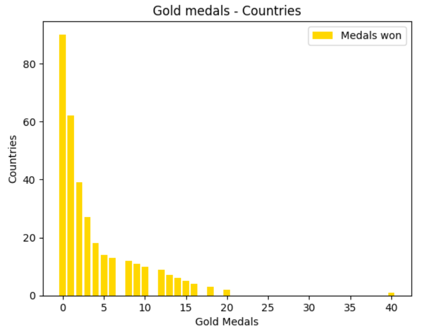

 

Through the gold medals chart it’s possible to see that most countries didn’t win any gold medal, and there is a decline in the number won by each country. There is a jump from twenty (20) medals won to forty and it’s possible to see that the number of countries that won fifteen (15) medals or more was considerably lower than the other countries.

This can indicate an inequality of competitive power among the countries again and possibly a lower investment in sports by the governments and maybe by the companies responsible for those countries who won a lower number of gold medals. So, it can be better for companies to invest in athletes that won a bigger number of gold medals, specially those who compete for countries where there is a good sports culture between the population. For example, there are some countries, like Brazil, where soccer receives more attention than other modalities, like winter sports.

### 2.4.2 Silver Medals Chart

  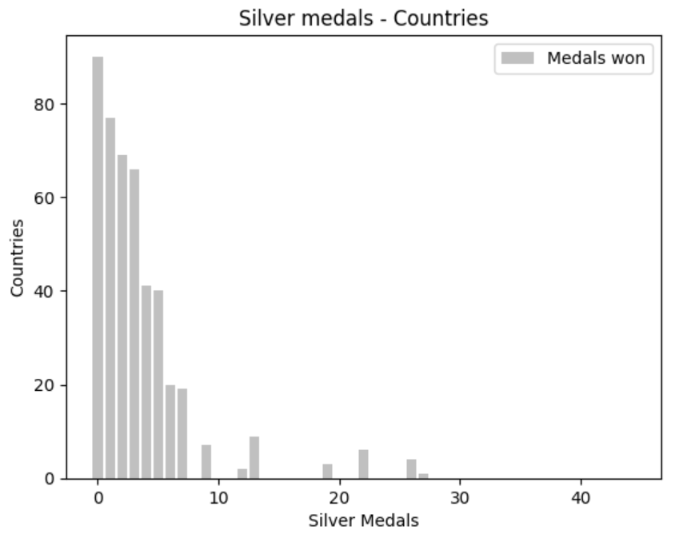

 

Through the silver medals chart it’s possible to see that again the most countries didn’t win any silver medal and up to the mark of ten (10) medals won there is a decline, but after that there is a variation, even that the number of countries that won more than it was below than twenty (20). This variation can testify that the main purpose between the athletes in Olympics is to win a gold medal, but sometimes the difference of preparation between them can be big and some countries, like the USA that won forty-four silver medals, can reach better results.

### 2.4.3 Bronze Medals Chart

  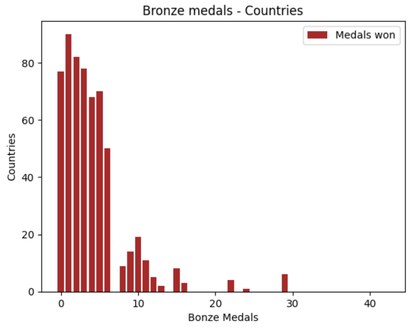

 

Through the bronze medals chart it’s possible to see that, differently from the charts of gold and silver medals, most countries won from one (1) to three (3) medals, and the variation was smoother. This variation can indicate that the distribution of medals won among the countries was more egalitarian when talking about bronze medals, which is the lowest prize in an Olympic contest and again testifying the inequality of competitive power among the countries.

### 2.4.4 Total Medals Charts

  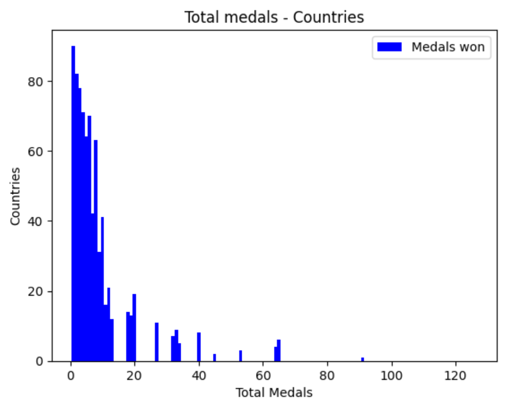

 

Through the bar total medals chart it’s possible to see that every country in the dataset won at least one (1) medal and there is a decline of medals won, which has a kind of variation through the chart. The highest concentration is between one (1) medal and twenty (20) medals won, from this point there is a smaller number of countries.

  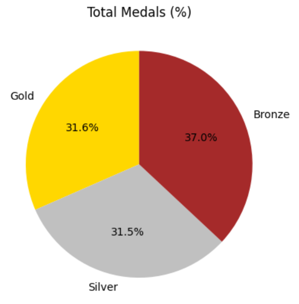

 

Through the pie totals medals chart, that shows the percentage of each kind of medals (gold, silver and bronze) won by the countries in the Olympics 2024, it’s possible to see that thirty-one point six percent (31.6%) of the medals won was gold medals, thirty-one point five percent (31.5%) was silver medals and thirty-seven was bronze medals. This means that there were more athletes that won bronze medals than the other medals.

### 2.4.5 First and Last Place Medals

Next there is a description and an analysis about the first (USA) and last (Zambia) place performances. Through the dataset it’s possible to see that the USA performance was considerably better than the other countries. It won forty (40) gold medals, forty-four (44) silver medals, forty-two (42) bronze medals and the total medals is one hundred and twenty-six (126) medals.

  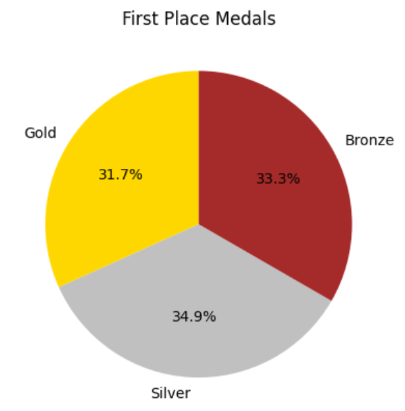

 

Zambia had a not so good performance as the USA. It won just one (1) bronze medal.

  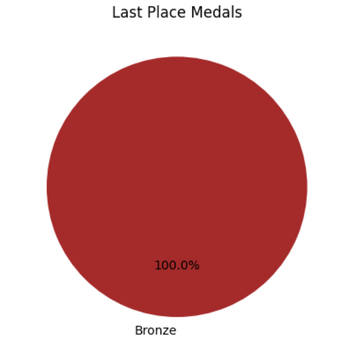

 

There is an extreme difference between the performance of these two countries in the Olympics 2024. Why? Probably the USA spent more resources (money in general) on their athletes. Possibly they received more incentive from the USA government, companies and people than Zambia athletes, which must have helped them to get better results. Of course, there might be other variables for this huge difference, but in this case a deeper research should be applied.

# 3. Pandas Analysis

Using Pandas, it was focused on analyzing the first placed countries in the Olympic Medals dataset and their achievements in the Olympics 2024. First it was found the five first placed countries and their medals. It’s possible to see them next.

  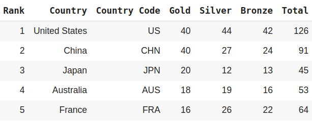

 

However, analyzing the dataset it’s possible to realize that not always the countries who are in the top positions in the rank had the better achievements. This difference among them will be analyzed next.

## 3.1 First Placed Countries Medals

Through the following chart it’s possible to see the five first placed countries in this Olympics edition. To rank the countries, the Olympics committee used the number of gold medals that each country won. So, it doesn’t necessarily mean the countries who won more silver, bronze and total medals have better positions in the rank.

  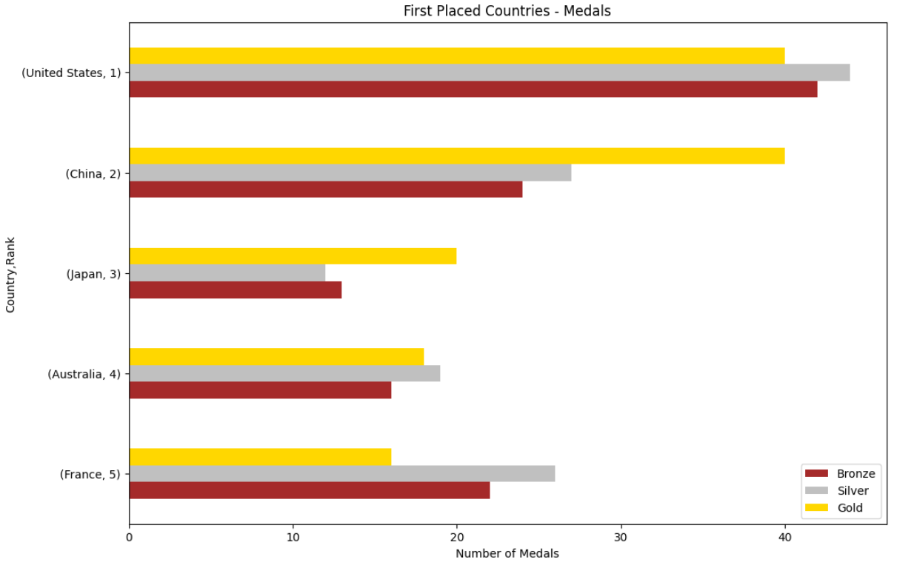

 

In this edition, the first place (USA) won more medals than the other countries, but the fifth place (France), which won less gold medals than Japan and Australia, won considerably more silver, bronze and total medals than them. This can indicate that France athletes from different modalities receive more resources than Japan and Australia athletes in general, because France athletes have a stronger presence on the podiums.

## 3.2 Best Achievements by Silver Medals

Next, it’s possible to realize that the countries who achieved better results in silver medals aren’t necessarily in the top five. The chart contains the only four countries that won more than twenty silver medals in this Olympic edition.

  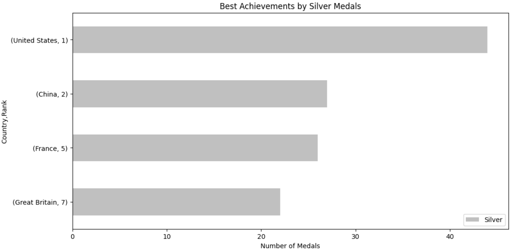

 

The seventh place (Great Britain) won more silver medals than Japan and Australia, which are at least three positions above it in the rank. There is a balance among China, France and Great Britain, which won less than thirty silver medals each, but The USA won more than forty silver medals, which is around double than them. Once again, the USA shows an aggressive competitive power.

## 3.3 Best Achievements by Bronze Medals

Through the following chart it’s possible to see the best results in terms of bronze medals won. Like what happened with silver medals, just four countries won more than twenty bronze medals, but, at this time, the rank had a more significant difference about the countries who are placed in the top positions.

  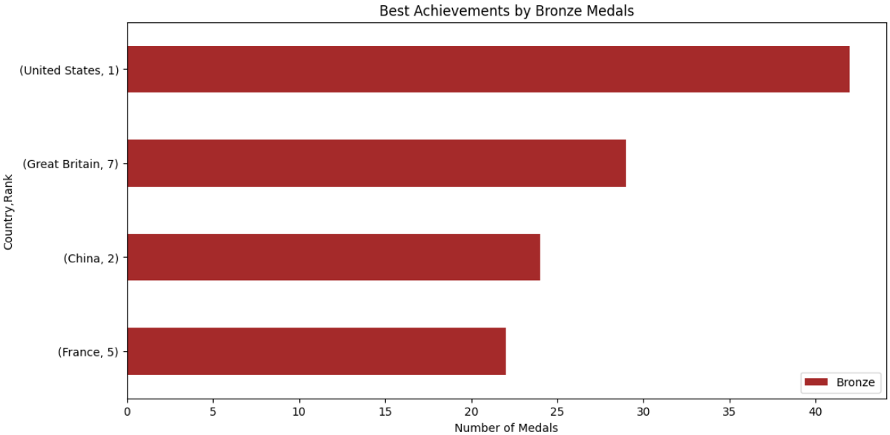

 

The USA keeps in first place and it’s possible to see that it won around double of bronze medals than France. But the most interesting aspect shown in this chart is that Great Britain, who is in seventh place in the original rank, won more bronze medals even than China, who is in second place in the original rank. But why? Probably because the Chinese athletes had a better performance winning more gold medals than the Great Britain ones. And this can indicate a stronger competitive power and more resources invested by the Chinese government and companies on their athletes than the most other countries.

Even so, France and Great Britain won more silver, bronze and total medals than Japan, Australia and the Netherlands (which is in sixth place, one position above Great Britain). This indicates that they had a better performance in general than the most other countries.

## 3.4 Best Achievements by Total Medals

In the Olympics 2024 just five countries won fifty medals or more. Although, there is a hard difference in terms of number among them. The USA keeps in first place with the most medals, followed by China, but the intriguing thing is that the third place in the next chart belongs to Great Britain, who are in the seventh place in the original rank.

  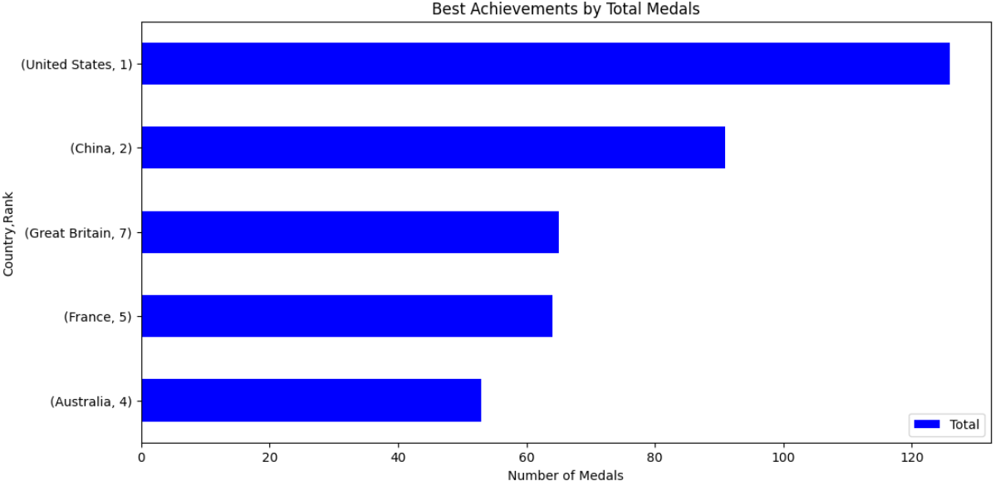

 

Through the chart it’s possible to see that France won more medals than Australia and even Japan, which doesn’t even appear in the graph because it won less than fifty medals. Once again, the USA had the best performance, winning twice as many medals as Australia, and there is a strong difference between the USA and China, which shows a significant presence on podiums of the USA athletes than athletes from other countries.

# 4. Final Conclusion

Throughout this project it was made an exploration and analysis about the better and even worst performances of the countries in the Olympics 2024. NumPy, Matplotlib and Pandas were used to do that.

Through the graphs it’s possible to realize that some countries had better results than others. Which indicates that their governments and companies may have invested more on their athletes and supported them. Culture, politics and economy can influence that.

Finally, if a company wants to support an athlete or an entire team it should research how this person or these people are seen by their compatriots, government and even by people from other countries, because the Olympics is a global sports event. For example, if an athlete has the habit of being rude in the media with their fans it can convey a bad message in the company’s image.

Matheus V. G. Pombeiro

Data Science Student

September 16, 2024

