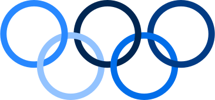

<h1>Olympic Medals</h1> 

<h2>1. About</h2> 

Olympic Medals is a Data Science authorial project, using Python and its libraries NumPy, Matplotlib and Pandas. The focus of this project is to analyze the number of medals won by each country in the Olympics 2024 based on the difference between the rank position of each country and their medals. For example, there are some countries that won more medals than others, but they are positioned below because the number of gold medals won by them was lesser than the others.

  

The dataset used on this project was taken from Kaggle. You can access its source by clicking on <a href="https://www.kaggle.com/datasets/berkayalan/paris-2024-olympics-medals/data" target="_blank" rel="noopener noreferrer">Olympic medals dataset</a>. Next you can see the author's analyzes and charts about the Olympic Medals topic organized in NumPy and Matplotlib and Pandas.

